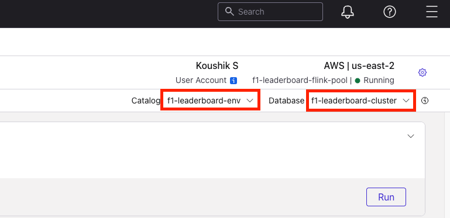

# F1 Real-Time Analytics Lab

## Building a Live F1 Leaderboard with Kafka and Flink

Build a real-time F1 racing leaderboard using Apache Kafka, Confluent Cloud, Apache Flink SQL, and React.

### What You'll Build
- Real-time race simulation with live position updates
- Performance analytics with average speed tracking
- Interactive driver selection and race management
- Live dashboard with Server-Sent Events


## Prerequisites

### Required Software
| Software | Version | Verification Command |
|----------|---------|---------------------|
| **Node.js** | 18+ | `node --version` |
| **npm** | 9+ | `npm --version` |
| **Python** | 3.11+ | `python3 --version` |
| **pip** | Latest | `pip3 --version` |
| **Git** | Latest | `git --version` |

### Required Accounts
- **Confluent Cloud Account** (Free tier available)
  - Sign up at: [https://www.confluent.io/confluent-cloud/tryfree](https://www.confluent.io/confluent-cloud/tryfree/)

### Pre-Lab Verification
```bash
node --version && npm --version
```
```bash
python3 --version && pip3 --version
```
```bash
git --version
```
```bash
python3 -m venv test_env && rm -rf test_env
```

## Part 1: Environment Setup

### Step 1.1: Clone the Repository and navigate to backend direcory
```bash
git clone <repository-url> && cd <repository-name>/backend
```

### Step 1.2: Set Up Backend Environment

Create virtual environment:
```bash
python3 -m venv venv
```
Activate virtual environment:

- On MacOS
  ```bash
  source venv/bin/activate  
  ```

- On Windows: 
  ```bash
  venv\Scripts\activate
  ```

Install dependecies:

```bash
pip install -r requirements.txt
```
Move to workshop root directory:
```bash
cd ..
```

### Step 1.3: Set Up Frontend Environment
```bash
cd frontend
```
```bash
npm install
```
```bash
cd ..
```

## Part 2: Confluent Cloud Setup

### Step 2.1: Create Confluent Cloud Account
- Go to [https://www.confluent.io/confluent-cloud/tryfree](https://www.confluent.io/confluent-cloud/tryfree/)
- Sign up and verify your account

### Step 2.2: Get Confluent Cloud Management API Credentials

To deploy infrastructure programmatically, you need Confluent Cloud Management API credentials:

1. Go to [Create API Keys](https://confluent.cloud/settings/api-keys/create?tab=cloud)
2. Click **My account**
3. Choose **Cloud resource management** for resource scope and click next
4. Provide name and description (Optional) and click next
5. Download API key and click **Complete**

### Step 2.3: Deploy Infrastructure Using Admin Script

1. **Set up admin environment:**
   ```bash
   cd admin
   ```
   ```bash
   python3 -m venv venv
   ```
   ```bash
   source venv/bin/activate
   ```
   ```bash
   pip install -r requirements.txt
   ```

2. **Configure credentials:**
   
   Option 1: Environment variables
   ```bash
   export CONFLUENT_CLOUD_API_KEY="your-api-key"
   export CONFLUENT_CLOUD_API_SECRET="your-api-secret"
   ```
   
   Option 2: Configuration file
   ```bash
   cp config.yaml.example config.yaml
   ```
   Edit `config.yaml` and add your credentials:
   ```yaml
   cloud_api_key: "your-api-key"
   cloud_api_secret: "your-api-secret"
   ```

3. **Run the admin script:**
   ```bash
   python main.py
   ```

   This script will automatically:
   - Create a Confluent Cloud environment
   - Create a Basic Kafka cluster in AWS us-east-2 region
   - Create a Flink compute pool in AWS us-east-2 region
   - Create service account with appropriate roles
   - Create Kafka and Schema Registry API keys
   - Create the `f1-driver-positions` topic
   - Register Avro schemas
   - Update `backend/config.yaml` with credentials

   > **Note:** The script is idempotent - safe to run multiple times. It will skip existing resources.

4. **Verify configuration:**
   Check that `backend/config.yaml` has been updated with your credentials:
   ```yaml
   kafka:
     bootstrap.servers: 'your-cluster-endpoint'
     security.protocol: "SASL_SSL"
     sasl.mechanism: "PLAIN"
     sasl.username: 'your-kafka-api-key'
     sasl.password: 'your-kafka-api-secret'
     schema_registry_url: 'your-schema-registry-url'
     schema_registry_api_key: 'your-schema-registry-api-key'
     schema_registry_secret: 'your-schema-registry-secret'
     topics:
       positions: "f1-driver-positions"
       commentary: "f1-commentary"
     consumer_group: "f1-leaderboard-consumer"
   ```

## Part 3: Running the Application

### Step 3.1: Start the Backend Server
```bash
cd backend
```
```bash
source venv/bin/activate
```
```bash
python3 main.py
```
> **Note: This command needs to be running all the time. Do not stop this server. Please continue the lab on a new Terminal Tab.**

### Step 3.2: Start the Frontend Application
Open a new terminal. Make sure you are in the directory of the repository. Then run the following.
```bash
cd frontend
```
```bash
npm run dev
```

> **Note: This command needs to be running all the time. Do not stop this server. Please continue the lab on a new Terminal Tab.**

## Part 4: Implement Flink SQL Analytics

### Step 4.1: Open SQL Workspace

1. **Navigate to Flink in Confluent Cloud:**
   - Go to [Flink UI](https://confluent.cloud/go/flink)
   - Select your environment from the dropdown

2. **Open SQL Workspace:**
   - Click on **Open SQL Workspace** button.

3. **Configure Catalog and Database:**
   - In the SQL Workspace, configure the catalog and database settings
   - Select your environment and Kafka cluster
   

### Step 4.2: Realtime Analytics with Confluent Cloud for Apache Flink

Now that you have the SQL Workspace open, execute the following Flink SQL statements one by one:

1. **Create Bedrock Connection:**
   
   First, update the AWS credentials in the connection configuration:
   - Replace `'aws-access-key' = '***'` with your AWS access key
   - Replace `'aws-secret-key' = '***'` with your AWS secret key
   - Replace `'aws-session-token' = '***'` with your AWS session token (if using temporary credentials)

   Then execute:
   ```sql
   CREATE CONNECTION `bedrock-connection`
   WITH (
     'type' = 'BEDROCK',
     'endpoint' = 'https://bedrock-runtime.us-east-1.amazonaws.com/model/us.anthropic.claude-3-5-sonnet-20240620-v1:0/invoke',
     'aws-access-key' = '***',
     'aws-secret-key' = '***',
     'aws-session-token' = '***'
   );
   ```

2. **Create Commentary Generator Model:**
   ```sql
   CREATE MODEL f1_commentary_generator
   INPUT (race_context STRING)
   OUTPUT (commentary STRING)
   WITH (
     'bedrock.connection'='bedrock-connection',
     'provider'='bedrock',
     'task'='text_generation',
     'bedrock.params.max_tokens' = '20000'
   );
   ```

3. **Create a f1_commentary topic**
   ```sql
  CREATE TABLE `f1-commentary` (
    id STRING,
    message STRING,
    `timestamp` BIGINT,
    type STRING
  ) WITH (
      'value.format' = 'json-registry'
  );
  ```

3. **Generate Real-Time Commentary:**
   ```sql
   INSERT INTO `f1-commentary`
   SELECT 
       CONCAT('comment-', CAST(UNIX_TIMESTAMP() AS STRING), '-', REPLACE(driver_name, ' ', '_')) AS id,
       ai_result.commentary AS message,
       `timestamp`,
       CASE 
           WHEN `position` = 1 THEN 'highlight'
           WHEN `position` <= 3 THEN 'warning'
           ELSE 'info'
       END AS type
   FROM `f1-driver-positions`,
   LATERAL TABLE(AGENT('f1_commentary_generator', 
       CONCAT('Driver: ', driver_name, 
              ', Position: ', CAST(`position` AS STRING), 
              '. Generate exciting F1 commentary. Keep it under 80 characters.')
   )) AS ai_result(commentary);
   ```

> **Note:** Make sure to replace the AWS credentials placeholders (`***`) with your actual AWS credentials before executing the first SQL statement.

## Part 6: Car Metrics and Anomaly Detection Setup (Optional)

This is an optional advanced feature that demonstrates real-time anomaly detection using Confluent Flink's ML_DETECT_ANOMALIES function. The feature is disabled by default and can be enabled via configuration.

### Step 6.1: Enable Anomaly Detection Feature

1. **Edit `backend/config.yaml`:**
   ```yaml
   features:
     anomaly_detection:
       enabled: true  # Set to true to enable anomaly detection
   ```

2. **Re-run the admin script** to create the required topics:
   ```bash
   cd admin
   ```
   ```bash
   source venv/bin/activate
   ```
   ```bash
   python main.py
   ```
   
   This will create:
   - `f1-car-metrics` topic (for car telemetry data)
   
   > **Note:** The `f1-car-metrics-anomalies` topic will be automatically created by Flink when you execute the anomaly detection INSERT statement (see Step 6.2).

3. **Restart the backend server** to activate the feature:
   ```bash
   cd backend
   ```
   ```bash
   source venv/bin/activate
   ```
   ```bash
   python3 main.py
   ```

### Step 6.2: Set Up Flink SQL for Anomaly Detection

1. **Open SQL Workspace** in Confluent Cloud Flink (same as Part 4)
   
   > **Note:** If using explicit connector configuration (not catalog), add full Kafka connector properties as shown in Part 4.

2. **Create sink table for detected anomalies (Flink will auto-create the Kafka topic):**
   ```sql
   CREATE TABLE `f1-car-metrics-anomalies` (
    key STRING,
    ts TIMESTAMP_LTZ(3),
    team_name STRING,
    engine_temperature DOUBLE,
    is_anomaly BOOLEAN,
    PRIMARY KEY (key, ts) NOT ENFORCED
  )
  DISTRIBUTED BY (key, ts)
  WITH (
    'changelog.mode' = 'upsert'
  );
   ```
   
   > **Note:** Using `changelog.mode = 'append'` because `ML_DETECT_ANOMALIES` in window functions doesn't support retraction. Anomalies are append-only events.
   
   > **Note:** The `f1-car-metrics-anomalies` Kafka topic will be automatically created by Flink when you execute the INSERT statement below.

3. **Create simple Flink SQL query for anomaly detection:**
   ```sql
    INSERT INTO `f1-car-metrics-anomalies`
    SELECT
      CAST(key AS STRING) AS key,
      TO_TIMESTAMP_LTZ(`timestamp`, 3) AS ts,
      team_name,
      engine_temperature,
      s.anomaly_results[6] AS is_anomaly
    FROM (
      SELECT
        key,
        team_name,
        `timestamp`,
        engine_temperature,
        ML_DETECT_ANOMALIES(
          engine_temperature,
          TO_TIMESTAMP_LTZ(`timestamp`, 3),
          JSON_OBJECT(
            'horizon' VALUE 1,
            'confidencePercentage' VALUE 90.0,
            'minTrainingSize' VALUE 16
          )
        ) OVER (
          PARTITION BY team_name
          ORDER BY TO_TIMESTAMP_LTZ(`timestamp`, 3)
          RANGE BETWEEN UNBOUNDED PRECEDING AND CURRENT ROW
        ) AS anomaly_results
      FROM `f1-car-metrics`
    ) AS s
    WHERE s.anomaly_results[6] = TRUE;
   ```
   

### Step 6.3: View Anomalies in UI

Once the feature is enabled and Flink queries are running:

1. **Start a race** as described in Part 5
2. **Watch the Anomaly Detection panel** on the right side of the UI
3. **Anomalies will appear in real-time** as they are detected by Flink
4. **Anomalies are color-coded by severity:**
   - 🔴 Critical: High confidence with extreme values
   - 🟡 Warning: Medium-high confidence
   - 🔵 Info: Lower confidence anomalies

### Feature Behavior

- **When enabled**: Car metrics are continuously produced during races, Flink detects anomalies, and they appear in the UI
- **When disabled**: No car metrics are produced, no Flink queries needed, and the UI shows a message that the feature is disabled
- **Default**: Feature is disabled (`enabled: false`) for backward compatibility

> **Note:** The anomaly detection feature requires additional Flink compute resources. Make sure your Confluent Cloud account has sufficient capacity.

## Part 5: Hands-On Lab Exercise

- Select a driver and start a race
- Watch the race starting animation
- Monitor live position updates
- View performance analytics
- Test race management controls
- (Optional) If anomaly detection is enabled: Monitor car metrics and detected anomalies in real-time

## Results


## Cleanup

### Stop the Application
- Stop backend: `Ctrl+C` in backend terminal
- Stop frontend: `Ctrl+C` in frontend terminal

### Clean Up Confluent Cloud

Before running the teardown script, stop all Flink SQL statements:

1. **Go to Flink SQL Workspace:**
   - Navigate to your Confluent Cloud console
   - Go to the Flink SQL Workspace
   - Stop all running statements

Use the teardown script to automatically delete all resources:

1. **Navigate to admin directory:**
   ```bash
   cd admin
   ```

2. **Activate virtual environment (if not already activated):**
   ```bash
   source venv/bin/activate
   ```

3. **Run the teardown script:**
   ```bash
   python teardown.py
   ```

   This script will automatically:
   - Delete Schema Registry subjects
   - Delete Kafka topics
   - Delete API keys (Kafka and Schema Registry)
   - Delete Flink compute pool
   - Delete Kafka cluster
   - Delete service account
   - Delete environment

   > **Note:** The script uses the same configuration as `main.py` (environment variables or `admin/config.yaml`). Make sure you have your Confluent Cloud Management API credentials configured.

4. **Verify deletion:**
   - Check the Confluent Cloud console to confirm all resources have been deleted
   - Some resources may take a few minutes to fully delete

### Local Cleanup
```bash
rm -rf backend/venv
rm -rf frontend/node_modules
rm -rf admin/venv
```

## Resources
- [Confluent Cloud Documentation](https://docs.confluent.io/cloud/current/)
- [Apache Kafka Documentation](https://kafka.apache.org/documentation/)
- [Apache Flink Documentation](https://flink.apache.org/docs/)
- [FastAPI Documentation](https://fastapi.tiangolo.com/)
- [React Documentation](https://react.dev/)

---

**🎉 Lab Complete!** You've successfully built a real-time F1 analytics application.
