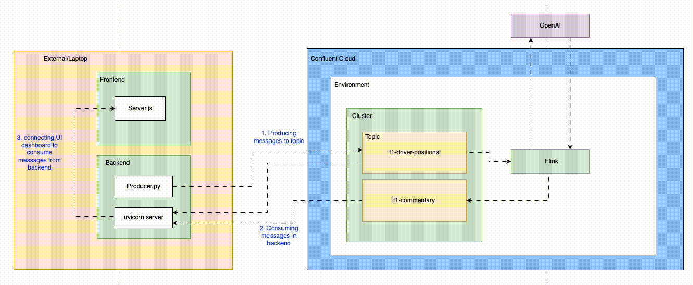

# F1 Leaderboard App v2

A real-time F1 racing leaderboard with live position updates, AI-powered commentary, and interactive driver selection powered by Kafka streaming and React. Experience the thrill of live F1 racing with dynamic position changes, automated race commentary, and the ability to follow your favorite driver's journey from start to podium finish.

> Looking for the original version? [Check out F1 Leaderboard App v1 here.](https://github.com/conflkrupa/F1-Racing-Leaderboard-POC/tree/main)



## Table of Contents

* [Features](#features)
* [Technologies Used](#technologies-used)
* [Prerequisites](#prerequisites)
* [Installation](#installation)
* [Running the Application](#running-the-application)
* [Backend Setup](#backend-setup)
* [Frontend Setup](#frontend-setup)
* [API Endpoints](#api-endpoints)
* [Confluent Cloud (Kafka) Integration](#confluent-cloud-kafka-integration)
* [Flink SQL Statements](#flink-sql-statements)
* [Graceful Shutdown](#graceful-shutdown)

## Features

* **Interactive Race Simulation:** Start a race with your chosen driver and watch them compete for podium positions
* **Real-time Position Updates:** Live leaderboard with dynamic position changes every second
* **Driver Selection:** Choose from 10 F1 drivers and follow their race journey
* **AI-Powered Commentary:** Automated race commentary generated using OpenAI GPT-3.5-turbo
* **Race Management:** Complete race lifecycle from start to finish with progress tracking
* **Podium Finishes:** Selected drivers can finish in 1st, 2nd, or 3rd place with realistic progression
* **Server-Sent Events:** Real-time data streaming for live updates without page refresh
* **Modern UI:** Clean, responsive interface with F1-themed styling and animations
* **Race Status Tracking:** Monitor race progress, elapsed time, and remaining duration
* **Final Results:** View complete race results and final standings

## Technologies Used

* **Backend:**
    * Python 3.11
    * FastAPI
    * Uvicorn
    * Confluent Kafka
    * Pydantic
    * FastAvro
* **Frontend:**
    * React 19.1.1
    * Vite
    * JavaScript (ES6+)
    * CSS3
* **Data Streaming:**
    * Confluent Cloud
    * Kafka Schema Registry
* **AI Integration:**
    * OpenAI GPT-3.5-turbo
    * Confluent Flink With AI

## Prerequisites

Before you begin, ensure you have the following installed and accounts set up:

* **Node.js and npm:** [https://nodejs.org/](https://nodejs.org/)
* **Python 3.11**: [https://www.python.org/downloads/](https://www.python.org/downloads/)
* **Pip3 installation**: [https://pip.pypa.io/en/stable/installation/](https://pip.pypa.io/en/stable/installation/)
* **Confluent Cloud Account:** You'll need an account on Confluent Cloud with a Kafka cluster set up. [https://www.confluent.io/confluent-cloud/tryfree](https://www.confluent.io/confluent-cloud/tryfree/)

## Installation

1.  **Clone the repository:**
   Open a code editor such as VS code. Open a terminal and run the following.

    ```bash
    git clone <repository-url>
    cd f1-leaderboard
    ```

2.  **Install backend dependencies:**

    ```bash
    cd backend
    python3 -m venv venv
    source venv/bin/activate  # On Windows: venv\Scripts\activate
    pip install -r requirements.txt
    cd ..
    ```

3.  **Install frontend dependencies:**

    ```bash
    cd frontend
    npm install
    cd ..
    ```

## Running the Application

1.  **Setup Confluent Cloud**
      
    * Sign in to Confluent Cloud- (https://confluent.cloud/auth_callback)
    * Create an Environment and a Basic Cluster
    * Create Kafka API key using this link- (https://docs.confluent.io/cloud/current/security/authenticate/workload-identities/service-accounts/api-keys/manage-api-keys.html#add-an-api-key).<br>
         a. Navigate to the hamburger icon on top right corner and select API Keys.<br>
         b. Click "Add API Key".<br>
         c. Select "User Account" and click "Next".<br>
         d. Select Kafka Cluster and below this, choose the Environment and Cluster you will be using and Click "Next".<br>
         e. Add a name and a description and click "Next".<br>
         f. Click "Download API Key" at the bottom beside Complete button and once downloaded, click "Complete"<br>
         
    * Create Schema Registry API key using this link- (https://docs.confluent.io/cloud/current/schema-registry/configure-schema-registry/configure-schema-registry-api-keys.html).<br>
         a. Navigate to Schema Registry in the left navigation pane.<br>
         b. Click "Add API Key".<br>
         c. Add a name and description for the API key.<br>
         d. Click "Download API Key" and save the credentials.<br>
    * Go to the cluster you created before. Go to topics in the left navigation pane, click topics.<br>
    * Click "Create a topic" and name it "**f1-driver-positions**". Create with Defaults. Skip the data contracts for now.<br>
    * Open the `backend/config.yaml` file and add your Confluent Cloud credentials:

       ```yaml
       kafka:
         bootstrap.servers: '<YOUR_CONFLUENT_CLOUD_CLUSTER_URL>'
         security.protocol: "SASL_SSL"
         sasl.mechanism: "PLAIN"
         sasl.username: '<YOUR_CONFLUENT_CLOUD_API_KEY>'
         sasl.password: '<YOUR_CONFLUENT_CLOUD_API_SECRET>'
         schema_registry_url: '<YOUR_SCHEMA_REGISTRY_URL>'
         schema_registry_api_key: '<YOUR_SCHEMA_REGISTRY_API_KEY>'
         schema_registry_secret: '<YOUR_SCHEMA_REGISTRY_SECRET>'
         topics:
           positions: "f1-driver-positions"
           commentary: "f1-commentary"
         consumer_group: "f1-leaderboard-consumer"
       ```

2.  **Start the backend server:**

    * **Open a new terminal window.**

    ```bash
    cd backend
    source venv/bin/activate
    python main.py
    ```
   * The server will start at `http://localhost:8001`.

3.  **Run the frontend:**
    * Open another **new terminal**
    * Navigate to frontend directory,
      ```bash
        cd frontend
      ```
    * Run the development server:
      ```bash
        npm run dev
      ```
    * This will display under which port the frontend is serving. The frontend will be available at `http://localhost:5173`.

## Backend Setup

The backend is built with Python FastAPI and handles API requests and consumes real-time data from Confluent Cloud (Kafka).

### Key Functionality

* **Confluent Cloud (Kafka) Consumer:**
    * Connects to Confluent Cloud using the provided credentials.
    * Subscribes to the specified Kafka topics.
    * Consumes real-time leaderboard data messages.
    * Parses the JSON messages using Avro schemas.
    * Streams real-time data directly to the frontend.
* **API Endpoints:** Provides REST endpoints to fetch leaderboard data and driver information.
* **Server-Sent Events:** Real-time streaming of position updates to connected clients.
* **CORS:** Enables Cross-Origin Resource Sharing to allow requests from the frontend.
* **Graceful Shutdown:** Handles signals to ensure proper disconnection from Confluent Cloud (Kafka) before exiting.
* **Error Handling:** Includes error logging and handling for Confluent Cloud (Kafka) and API requests.

## Frontend Setup

The frontend is built with React and Vite, providing a modern, responsive interface for the F1 leaderboard.

### Dependencies

* React 19.1.1
* Vite
* Google Fonts (Inter, Orbitron)

### Key Functionality

* **Data Fetching:** Fetches leaderboard data from the backend API.
* **Real-time Updates:** Uses Server-Sent Events for live data streaming.
* **Data Rendering:** Dynamically generates the leaderboard table with the fetched data.
* **Driver Highlighting:** Highlights the selected driver in the table.
* **Loading Indicators:** Shows loading states while fetching data.
* **Error Handling:** Displays error messages to the user.
* **Responsive Design:** Uses modern CSS for a responsive layout.

## API Endpoints

* `/api/health` (GET): Health check endpoint
* `/api/drivers` (GET): Returns the list of available drivers
* `/api/positions/stream` (GET): Server-Sent Events stream for real-time position updates
* `/api/commentary/stream` (GET): Server-Sent Events stream for real-time commentary updates

## Confluent Cloud (Kafka) Integration

The application integrates with Confluent Cloud for real-time data streaming:

* **Topics:** 
    * `f1-driver-positions`: Contains real-time driver position updates with schema validation
    * `f1-commentary`: Contains AI-generated commentary messages for race events
* **Schema Registry:** Implements Avro schemas for data validation and evolution
* **Consumer Groups:** Manages consumer groups for reliable message processing
* **Error Handling:** Includes comprehensive error handling for Kafka operations

## Flink SQL Statements

The application includes Apache Flink SQL integration for AI-powered commentary generation:

### Create Commentary Topic
```sql
CREATE TABLE `f1-commentary` (
    id STRING,
    message STRING,
    `timestamp` BIGINT,
    type STRING
) WITH (
    'value.format' = 'json-registry'
);
```

### Create OpenAI Connection
```sql
CREATE CONNECTION openai_connection
WITH (
  'type' = 'openai',
  'endpoint' = 'https://api.openai.com/v1/chat/completions',
  'api-key' = '***'
);
```

### Create Commentary Generator Model
```sql
CREATE MODEL f1_commentary_generator
INPUT (race_context STRING)
OUTPUT (commentary STRING)
WITH (
  'provider' = 'openai',
  'openai.connection' = 'openai_connection',
  'openai.model_version' = 'gpt-3.5-turbo',
  'openai.system_prompt' = 'You are an expert F1 racing commentator. Generate exciting, engaging commentary about F1 drivers based on their current race position, points, and performance. Keep commentary under 100 characters and make it exciting and dynamic.',
  'task' = 'text_generation'
);
```

### Generate Commentary
```sql
INSERT INTO `f1-commentary`
SELECT 
    CONCAT('comment-', CAST(UNIX_TIMESTAMP() AS STRING), '-', REPLACE(driver_name, ' ', '_')) AS id,
    ai_result.commentary AS message,
    `timestamp`,
    CASE 
        WHEN `position` = 1 THEN 'highlight'
        WHEN `position` <= 3 THEN 'warning'
        ELSE 'info'
    END AS type
FROM `f1-driver-positions`,
LATERAL TABLE(AI_COMPLETE('f1_commentary_generator', 
    CONCAT('Driver: ', driver_name, 
           ', Position: ', CAST(`position` AS STRING), 
           '. Generate exciting F1 commentary. Keep it under 80 characters.')
)) AS ai_result(commentary);
```

## How to Use the Application

Once the application is running, follow these steps to experience the live F1 leaderboard:

1. **Open the Frontend:**
   - Navigate to `http://localhost:5173` in your web browser
   - The F1 Live Leaderboard application will load

2. **Choose a Driver:**
   - On the home page, you'll see a list of available F1 drivers
   - Click on your favorite driver to select them
   - This will highlight your chosen driver throughout the race

3. **Visualize Live Updates:**
   - The leaderboard will display real-time position updates
   - Watch as drivers' positions change dynamically
   - Your selected driver will be highlighted in the standings

4. **View Commentary:**
   - The commentary panel will show AI-generated race commentary
   - Commentary updates automatically based on race events
   - Different types of commentary (highlight, warning, info) provide context

5. **Monitor Race Progress:**
   - Track position changes with visual indicators
   - See real-time updates without refreshing the page
   - Experience the excitement of live F1 racing data

## Results


## Graceful Shutdown

Here are the steps to shutdown the application.

* Stop running main.py and npm run dev by clicking cmd+c/ctrl-c to stop these programs.
* Go to Confluent Cloud and delete the topics "f1-driver-positions" and "f1-commentary", then delete the cluster and the environment.
